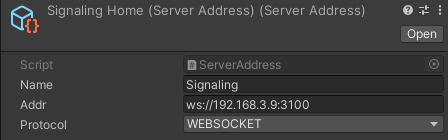

# TLabNetworkedVR
Multiplayer networking library for VR applications.

## Protocol

| Sync Target                    | Protocol  | 
| ------------------------------ | --------- | 
| Transform (or Rigidbody)       | WebRTC    | 
| Animator (Not fully supported) | WebSocket | 

| Message Type                 | Protocol  | 
| ---------------------------- | --------- | 
| Voice Chat                   | WebRTC    | 
| Video Chat                   | None      |
| Custom Message (Json Format) | WebSocket | 

## Getting Started

### Prerequisites
- Unity 2021.3.37f1 (meta xr sdk requires Unity Editor 2021.26f1 ~.)  
- node (v16.15.0)
- [unity.webrtc](https://github.com/Unity-Technologies/com.unity.webrtc)
- [NativeWebsocket](https://github.com/endel/NativeWebSocket)
- [meta-xr-all-in-one-sdk](https://assetstore.unity.com/packages/tools/integration/meta-xr-all-in-one-sdk-269657)  

### Server Set Up
- Clone this node.js server [TLabNetworkedVR-Server](https://github.com/TLabAltoh/TLabNetworkedVR-Server.git)

1. Set the ```SignalingServer``` and ```SyncServer``` addresses in Unity
<table>
	<tr>
		<td>
			
		</td>
	</tr>
	<tr>
		<td>
			
		</td>
		<td>
			
		</td>
	</tr>
</table>

2. Execute the following commands in ```TLabNetworkedVR-Server/SyncServer```

```
npm start
```

or

```
start.bat
```

3. Execute the following commands in ```TLabNetworkedVR-Server/WebRTCSignaling```

```
npm start
```

or

```
start.bat
```

## TODO
- Add a threshold to the amount of movement that the object will be synchronised, do not synchronise object transform every frame.
- Re-implement Regidbody's guess-physics result calculation, which is performed when packets are lost.

## Sample Project
[VR_Classroom](https://github.com/TLabAltoh/VR_Classroom.git)
