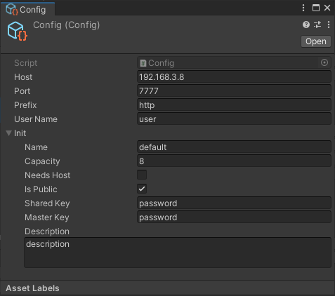
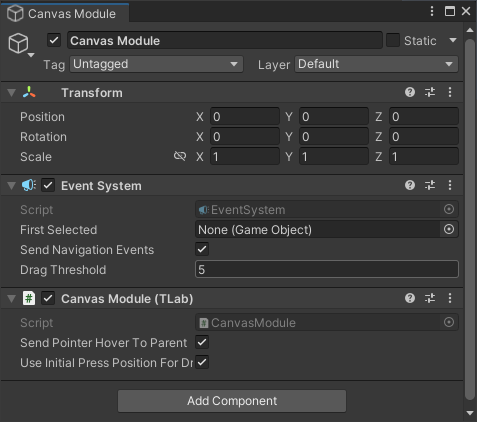
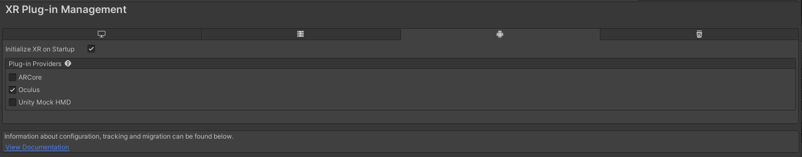
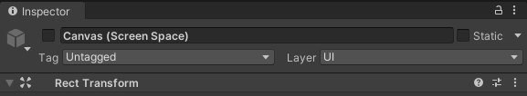
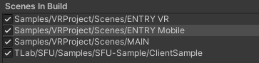
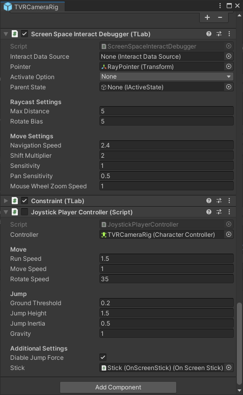
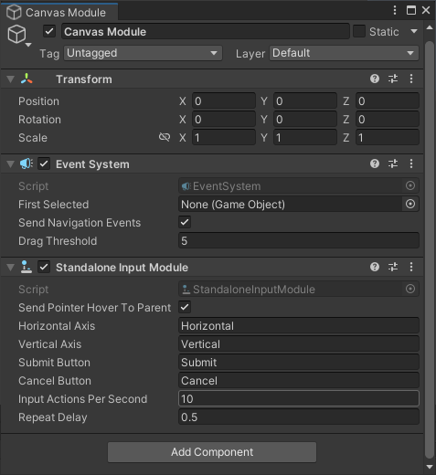
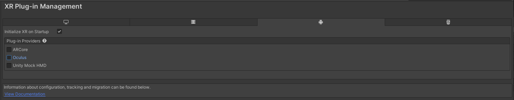
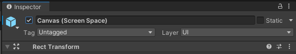
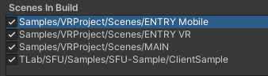

# Unity-SFU-Integration

Sample project for implementing ```SFU (Selectable Forwarding Unit)``` network architecture on the Unity.

## Features
### ```WebRTC```
- [x] ```DataChannel```  
- [x] ```Audio```  
- [ ] ```Video``` (Not tested yet)  
### ```WebSocket```
- [x] ```Binary```
- [ ] ```Text```
### Synchronise the unity's component
- [x] ```Transform```
  - [x] With Interpolation
  - [x] With out Interpolation
  - [ ] With ```Rigidbody```
- [x] ```Animator```
  - [ ] With Interpolation
  - [x] With out Interpolation

## Get Started

### Project Setup
- Clone this repository with the following command.

```bat
git clone https://github.com/TLabAltoh/Unity-SFU-Integration
cd Unity-SFU-Integration
git submodule update --init
```

- Select ```Multi Pass``` in ```ProjectSettings/XR Plug-in Management/Oculus/Stereo Rendering Mode``` for UI canvas and hand tracking rendering.

- Search asset that named ```Config``` on the Project view and set your server's ip/port.

- Open ```Assets/Samples/VRProject/Scenes/MAIN.unity```

</img>

<details><summary>Oculus Quest or PC</summary>

- Replace ```StandaloneInputModule``` with ```CanvasModule```

</img>

- Please confirm that the following setting

</img>  
</img>  
</img>  
</img>


</details>

<details><summary>Android Mobile (not Oculus Quest)</summary>

- Replace ```CanvasModule``` with ```StandaloneInputModule```

</img>

- Please confirm that the following settings

</img>  
</img>  
</img>  
</img>

</details>


- Play ```Assets/Samples/VRProject/Scenes/MAIN.unity``` on the Unity Editor or build app

> [!NOTE]
> The first joiner is treated as the host, but UI operation is only supported in Oculus / PC mode. The Android mobile client must join after the host joins.

### How to move character
```PC```: just same as Unity Editor's Scene View.  
```Oculus Quest```: Headset's Position Tracking  
```Android Mobile```: Joystick at bottom left of screen.

### Server Setup

- Clone and run the server repository with the following command.

```bat
git clone https://github.com/TLabAltoh/unity-rust-sfu.git
cd unity-rust-sfu
build-debug.bat
run.bat
```
