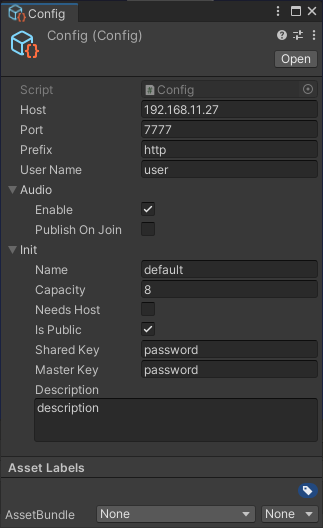
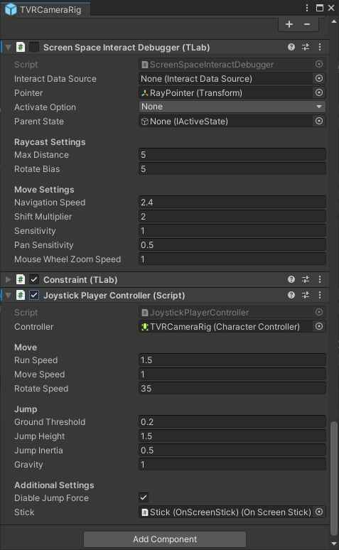

# Unity-SFU-Integration

Test project for implementing ```SFU (Selectable Forwarding Unit)``` network architecture on the Unity. This project was created for use in Oculus Quest 2, but supports other platforms (PC, Android mobile) to test the connection from multiple clients.

## Features
### ```WebRTC```
- [x] ```DataChannel```  
- [x] ```Audio```  
- [ ] ```Video``` (Not tested yet)  
### ```WebSocket```
- [x] ```Binary```
- [ ] ```Text (No plans at the moment.)```
### Interactor
- [x] ```Grab```
- [x] ```Ray```
- [ ] ```Poke```
### Synchronise the unity's component
- [x] ```Transform (threshold base)```
  - [x] With ```Rigidbody```
  - [x] With ```Interpolation```
  - [x] Without ```Interpolation```
- [x] ```Animator```
  - [ ] With ```Interpolation```
  - [x] Without ```Interpolation (Poor test ...)```
- [x] Avator
  - [x] ```Headset```
  - [x] ```Hand/Finger```
  - [ ] ```Elbows/Knees (Maybe I need to add IK first to support it ...)```

## Get Started

### Project Setup
- Clone this repository with the following command.

```bat
git clone https://github.com/TLabAltoh/Unity-SFU-Integration
cd Unity-SFU-Integration
git submodule update --init
```

- Select ```Multi Pass``` in ```ProjectSettings/XR Plug-in Management/Oculus/Stereo Rendering Mode``` for UI canvas and hand tracking rendering.

- Search asset that named ```Config``` on the Project view and set your server's ip/port.

- Open ```Assets/Samples/VRProject/Scenes/MAIN.unity```

</img>

<details><summary>Oculus Quest or PC</summary>

You may not need to check this as the bellow is the default setting.

- Replace ```StandaloneInputModule``` with ```CanvasModule```

</img>

- Please confirm that the following setting

</img>  
</img>  

Gameobject.name: "Canvas Module"  
</img>  

Gameobject.name: "TVRCameraRig"  
</img>


</details>

<details><summary>Android Mobile (not Oculus Quest)</summary>

- Replace ```CanvasModule``` with ```StandaloneInputModule```

</img>

- Please confirm that the following settings

</img>  
</img>  

Gameobject.name: "Canvas Module"  
</img>  

Gameobject.name: "TVRCameraRig"  
</img>

</details>


- Play ```Assets/Samples/VRProject/Scenes/MAIN.unity``` on the Unity Editor or build app

> [!NOTE]
> The first joiner is treated as the host, but UI operation is only supported in Oculus / PC mode. The Android mobile client must join after the host joins.

### How to move character
```PC```: just same as Unity Editor's Scene View.  
```Oculus Quest```: Headset's position tracking  
```Android Mobile```: Joystick at bottom left of screen.

### Server Setup

- Clone and run the server repository with the following command.

```bat
git clone https://github.com/TLabAltoh/unity-rust-sfu.git
cd unity-rust-sfu
build-debug.bat
run.bat
```

## Issue
### Unstable connection ?
Very occasionally the connection was disconnected even if there were only 2 clients.
  
### Poor test
This project has only been tested on a local network and not on a dedicated server. The server was hosted on a general Windows PC.

### Poor documentation
All the features are implemented on the sample scene. And the project has continuously do destractive update. So documentation will be made after project architecture is stable.